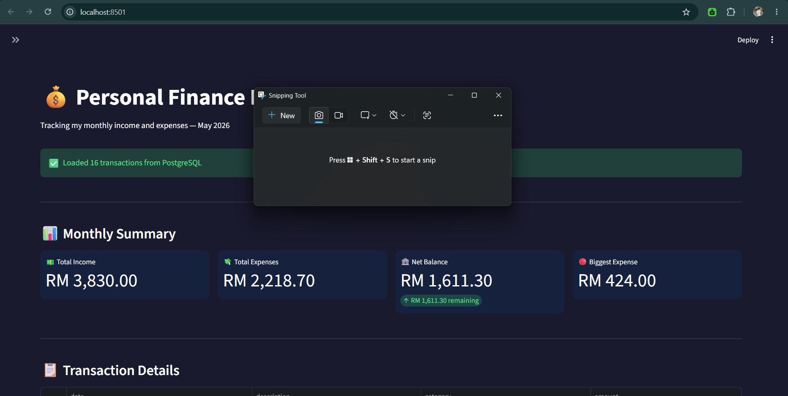
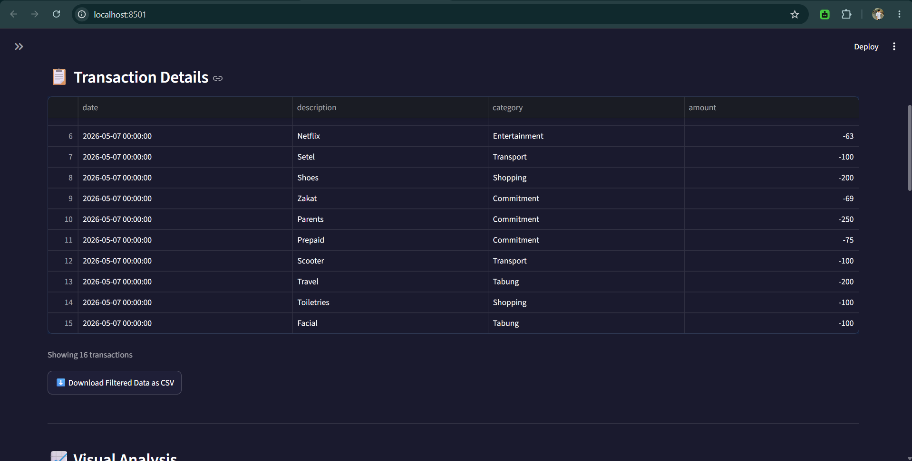
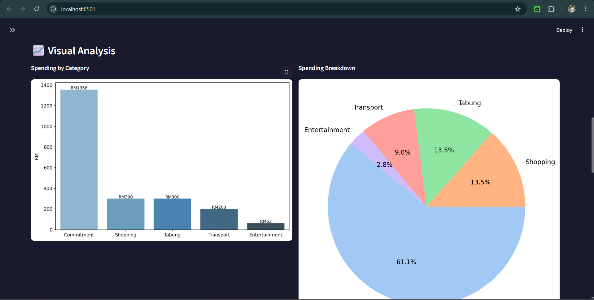

# 💰 Personal Finance Analytics Pipeline

A full end-to-end data analytics project demonstrating 
real-world data engineering and analysis skills.

## 📸 Dashboard Preview

## 🚀 Tech Stack

| Tool | Purpose |
|------|---------|
| Python + Pandas | Data processing and analysis |
| PostgreSQL | Relational database and SQL queries |
| MongoDB | NoSQL document storage |
| Redis | Caching layer for performance |
| Apache Flink | Real-time streaming alert pipeline |
| Streamlit | Interactive web dashboard |
| Matplotlib + Seaborn | Data visualization |

## 📊 Project Overview

This project simulates a personal finance tracking system with:
- **ETL Pipeline** — ingests, cleans, and transforms transaction data
- **Multi-database architecture** — PostgreSQL for structured data,
  MongoDB for flexible metadata, Redis for caching
- **Real-time alert system** — Flink-style streaming that detects
  large expenses, shopping patterns, and income events
- **Interactive dashboard** — Streamlit app with live filters,
  charts, and CSV export

## 🗂️ Project Structure

finance-tracker/
├── week1day1.py                   # Python basics and data structures
├── week1day2_csv.py               # CSV read/write
├── week1day2_connect.py           # Python + PostgreSQL connection
├── week1day3_pandas.py            # Pandas data analysis
├── week1day3_from_db.py           # PostgreSQL to Pandas pipeline
├── week1day3_challenge.py         # Pandas challenges
├── week1day4_charts.py            # Matplotlib + Seaborn charts
├── week1day5_dashboard.py         # Streamlit interactive dashboard
├── week1day6_mongo.py             # MongoDB document storage
├── week1day6_challenge.py         # MongoDB queries
├── week1day7_redis.py             # Redis caching
├── week1day7_challenge.py         # Redis challenges
├── week1day7_final_project.py     # Full pipeline — all tools together
├── week2_day1_flink.py            # Real-time streaming alerts
├── week2_day1_challenge.py        # Flink challenge
├── requirements.txt               # Python dependencies
└── README.md                      # Project documentation

## ⚙️ Setup and Installation

1. Clone the repo:
git clone https://github.com/m7iqbal/finance-tracker.git
cd finance-tracker

2. Install dependencies:
pip install -r requirements.txt

3. Create .env file:
DB_PASSWORD=your_password
DB_HOST=localhost
DB_NAME=finance_tracker
DB_USER=postgres

4. Set up PostgreSQL and run the INSERT script in week1day2_connect.py

5. Run the dashboard:
streamlit run week1day5_dashboard.py

## 📈 Dashboard Features

- 📊 Monthly summary cards — income, expenses, net balance
- 🔍 Sidebar filters — category, transaction type, date range
- 📋 Interactive transaction table with CSV export
- 📈 Spending by category bar chart
- 🥧 Spending breakdown pie chart
- 📉 Expense timeline with average line
- 🔒 Commitment breakdown pie chart and details

## ⚡ Real-Time Streaming Alerts

The Flink-style streaming pipeline processes transactions
in real time and fires alerts for:
- 🚨 Large expenses over RM100 — HIGH priority
- 🛍️ Shopping transactions detected
- 💰 Income received notification
- 🍔 Food overspending over RM50

All alerts stored in Redis for instant retrieval.

## 👨‍💻 Author

**iQbalhoran**
Electrical and Project Engineer transitioning into Data Analytics

GitHub: https://github.com/m7iqbal